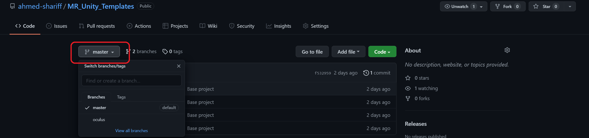
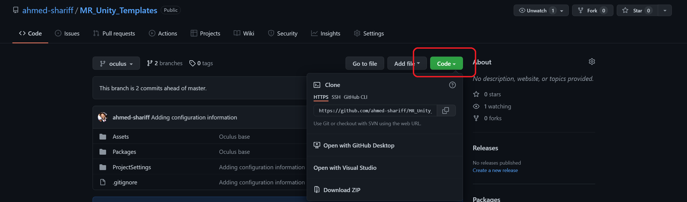

Repo of templates to use when starting different unity projects. There are mulitple templates, each as a seperate branch. Currently, the following templates are hosted in this repo:

| Branch name   | Description                                                                                                         |
|---------------|---------------------------------------------------------------------------------------------------------------------|
| `main`        | Basic Unity3D project without any packages/assets                                                                   |
| `oculus`      | Contains the Oculus-integration from the asset store and related packages. Also, configured for oculus development. |
| `oculus-mrtk` | Everything from the `oculus` branch with MRTK. Installed MRTK Extensions and MRTK Examples.                         |
| `vuforia`     | Has the vuforia packages configured.                                                                                |

## Usage
### Using git
- Clone the repository
```bash
git clone https://github.com/ahmed-shariff/MR_Unity_Templates.git
```
- Switch to the branch you are interested in. For example if you want to start from the branch `oculus`
```bash
git switch oculus
```

### Direct download
- Select the appropriate branch from the dropdown (highlighted in red)

- Under the Code section (highlited in red), select the `Download zip` option. Optionally if you have Github Desktop or Visual Studio installed and configured, you can select the corresponding options to download the repo using that. Note that, if you use these options you will have to switch to the appropriate branch once the repo is cloned (downloaded)


